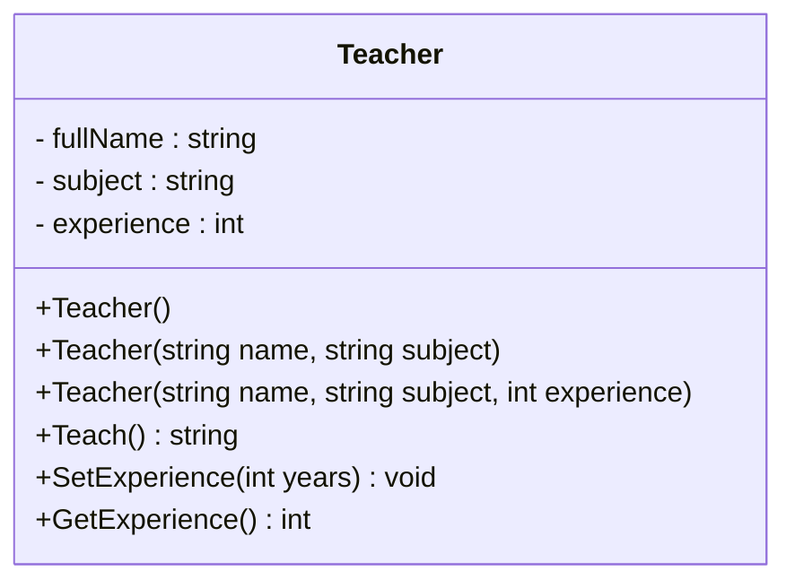
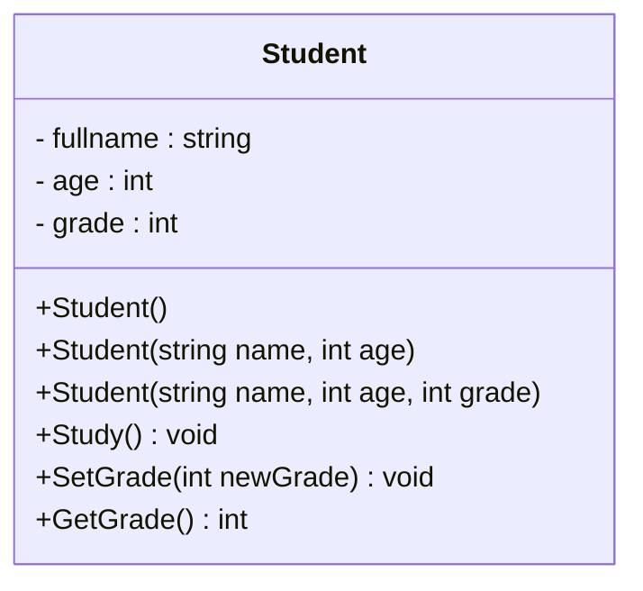
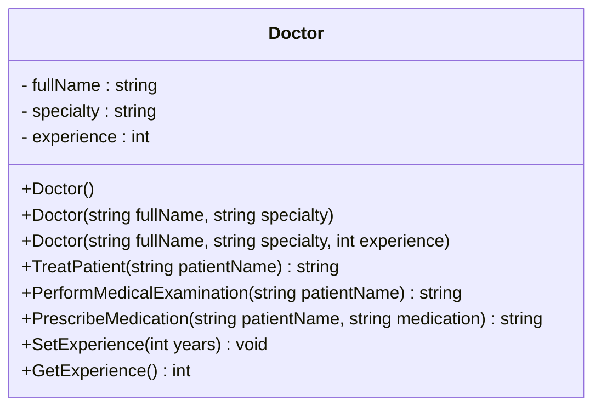
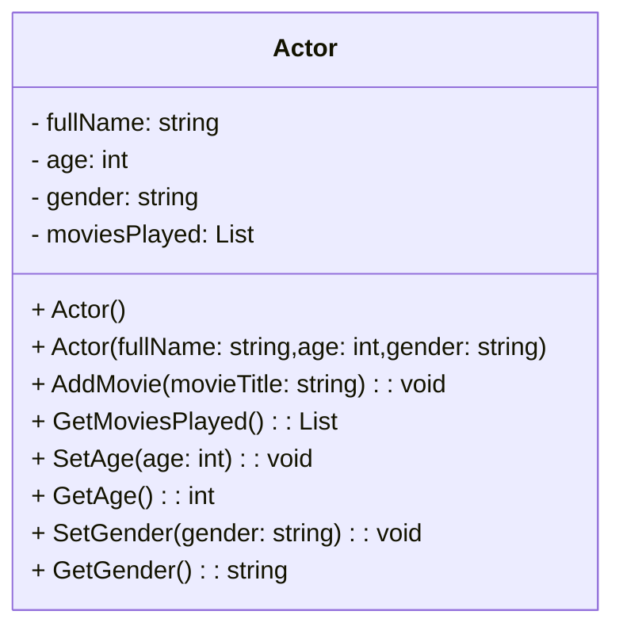

### Task1    

Create a class called `Teacher` with the following characteristics: 

- `fullName` - a string representing the teacher's name.
- `subject` - a string representing the subject the teacher teaches.
- `experience` - an integer representing the number of years of experience the teacher has.

The class `Teacher` should have the following methods: 

1. A method called `Teach()` that prints a message in the format `{fullName} is teaching {subject}.` For example, `Shahrom is teaching mathematics.`

2. A method called `SetExperience(int years)` that takes the number of years of experience as an argument and sets the corresponding value in the `experience` field.

3. A method called `GetExperience()` that returns the teacher's experience.

The class `Teacher` should have multiple constructors:

1. A default constructor that takes no arguments and does nothing.

2. A constructor that takes two arguments: the teacher's name and the subject. The constructor should set the respective values in the `name` and `subject` fields.

3. A constructor that takes three arguments: the teacher's `name`, the `subject`, and the `experience`.                                                                                 

Please note that all fields of the `Teacher` class should be encapsulated `private`, and access to them should be done through constructor.

----

Создайте класс `Teacher` (Учитель) со следующими характеристиками:

- `fullName` (имя) - строка, представляющая имя учителя.
- `subject` (предмет) - строка, представляющая предмет, который преподает учитель.
- `experience` (стаж) - целое число, представляющее количество лет опыта учителя.

Класс `Teacher` должен иметь следующие методы:

1. Метод `Teach()`, который выводит сообщение в формате `{name} teaching {subject}.` (например, `Shahrom is teaching mathematics.`).

2. Метод `SetExperience(int years)`, который принимает количество лет стажа и устанавливает соответствующее значение в поле `experience`.

3. Метод `GetExperience()`, который возвращает стаж учителя.

Класс `Teacher` должен иметь несколько конструкторов:

1. Пустой конструктор, который не принимает аргументов и не выполняет никаких действий.

2. Конструктор, принимающий два аргумента: имя и предмет учителя. Конструктор должен устанавливать соответствующие значения в поля `name` и `subject`.

3. Конструктор, принимающий три аргумента: имя, предмет и стаж учителя. Конструктор должен устанавливать соответствующие значения в поля `name`, `subject` и `experience`.

Обратите внимание, что все поля класса `Teacher` должны быть инкапсулированы `private`, и доступ к ним должен осуществляться через конструктор.

----

Класи `Teacher`-ро бо хусусиятҳои зерин созед:

- `fullName` (string) - сатр, номи муаллим.
- `subject` (string) - сатр, фанне ки муаллим таълим медиҳад.
- `experience` (таҷриба) - адади бутун шумораи солҳои тачрибаи омӯзгор.

Класи `Teacher` бояд методхои зерин дошта бошад:

1. Методи `Teach()`, ки паёмро дар формати `{name} teaching {subject}` нишон медиҳад. (масалан, `Shahrom is teaching mathematics.`).

2. Методи `SetExperience(int years)`, ки шумораи солҳои таҷрибаро мегирад ва дар `experience` арзишро мегузорад.

3. Методи `GetExperience()`, ки таҷрибаи муаллимро бармегардонад.

Класи `Teacher`  бояд якчанд конструктор дошта бошад:

1. Конструтори холӣ, ки ягон аргумент намегирад ва ягон амалро иҷро намекунад.

2. Конструкторе, ки ду параметр мегирад: ном ва предмети муаллим. 

3. Конструкторе, ки се параметр мегирад: ном, фан ва таҷрибаи омӯзгор. 

Лутфан таваҷҷӯҳ намоед, ки ҳамаи майдонҳои класи `Teacher` бояд инкапсулизатсия карда шаванд `private` ва ба онҳо тавассути конструктор дастрас карда шаванд.





### Task2 

Create a class called `Student` with the following characteristics:

- `fullname` - a string representing the student's name.
- `age` - an integer representing the student's age.
- `grade` - an integer representing the student's current grade level.

The class `Student` should have the following methods:

1. A method called `Study()` that prints a message in the format `{fullname} is studying.` For example, `Abdullo is studying.`

2. A method called `SetGrade(int newGrade)` that takes a new grade as an argument and sets the corresponding value in the `grade` field.

3. A method called `GetGrade()` that returns the student's grade.

The class `Student` should have multiple constructors:

1. A default constructor that takes no arguments and does nothing.

2. A constructor that takes two arguments: the student's name and age. The constructor should set the respective values in the `fullname` and `age` fields.

3. A constructor that takes three arguments: the student's name, age, and grade. The constructor should set the respective values in the `fullname`,  `age` and `grade` fields.

Please note that all fields of the `Student` class should be encapsulated `private`, and access to them should be done through properties.

----

Создайте класс под названием `Student` со следующими характеристиками:

- `fullname` — строка, представляющая имя студента.
- `age` — целое число, обозначающее возраст учащегося.
- `grade` — целое число, представляющая текущий уровень успеваемости учащегося.

Класс `Student` должен иметь следующие методы:

1. Метод под названием `Study()`, который печатает сообщение в формате `{fullname} is studying.`. Например, `Abdullo is studying.`.

2. Метод под названием `SetGrade(int newGrade)`, который принимает новую оценку в качестве аргумента и устанавливает соответствующее значение в поле `grade`.

3. Метод `GetGrade()`, возвращающий оценку учащегося.

Класс `Student` должен иметь несколько конструкторов:

1. Конструктор по умолчанию, который не принимает аргументов и ничего не делает.

2. Конструктор, принимающий два аргумента: имя и возраст ученика. Конструктор должен установить соответствующие значения в полях `fullname` и `age`.

3. Конструктор, принимающий три аргумента: имя учащегося, возраст и класс. Конструктор должен установить соответствующие значения в полях `fullname`, `age` и `grade`.

Обратите внимание, что все поля класса `Student` должны быть инкапсулированы `private`, и доступ к ним должен осуществляться через свойства.


----

Класе бо номи `Student` бо хусусиятҳои зерин созед:

- `fullname` - сатр, номи донишҷӯ.
- `age` - адади бутун, синну соли донишҷӯ.
- `grade` - адади бутун, caтхи донишҷӯ (синфи чанд).

Класи `Student` бояд методхои зеринро дошта бошад:

1. Методи `Study()`, ки паёмро дар формати `{name} is studying.` чоп мекунад. Масалан, `Abdullo is studying`.

2. Метод бо номи `SetGrade(int newGrade)`, ки баҳои навро ҳамчун аргумент гирифта, арзиши мувофиқро дар майдони `grade` муқаррар мекунад.

3. Метод бо номи `GetGrade()`, ки cатхи донишҷӯро бармегардонад.

Класи `Student` бояд якчанд конструктор дошта бошад:

1. Конструтори холи, ки ягон параметр қабул намекунад ва ҳеҷ кор намекунад.

2. Конструкторе, ки ду параметр мегирад: ном ва синну соли донишҷӯ. Конструктор бояд арзишҳои мувофиқро дар майдонҳои `fullname` ва `age` муқаррар кунад.

3. Конструкторе, ки се параметр мегирад: ном, синну сол ва синфи хонанда. Конструктор бояд арзишҳои мувофиқро дар майдонҳои `fullname`, `age` ва `grade` муқаррар кунад.

Лутфан таваҷҷӯҳ намоед, ки ҳамаи майдонҳои класи `Student` бояд `private` бошанд ва дастрасӣ ба онҳо бояд тавассути конструктор анҷом дода шавад.





### Task3

 Create a class `Doctor` with the following characteristics:

- `fullName` - a string representing the doctor's full name.
- `specialty` - a string representing the doctor's medical specialty (e.g., surgeon, general practitioner, cardiologist, etc.).
- `experience` - an integer representing the number of years of experience the doctor has.
The `Doctor` class should have the following methods:

A method `TreatPatient(string patientName)` that returns a string in the format `"{fullName}, {specialty}, is treating a patient named {patientName}"`.

A method `PerformMedicalExamination(string patientName)` that returns a string in the format `"{fullName} is performing a medical examination for the patient named {patientName}"`.

A method `PrescribeMedication(string patientName, string medication)` that returns a string in the format `"{fullName} prescribes {medication} for the patient named {patientName}"`.

A method `SetExperience(int years)` that sets the number of years of experience for the doctor.

A method `GetExperience()` that returns the number of years of experience for the doctor.

The `Doctor` class should have multiple constructors:

A default constructor that takes no arguments and does nothing.

A constructor that takes two arguments: the doctor's full name and the medical specialty. The constructor should set the respective values in the `fullName` and `specialty` fields.

A constructor that takes three arguments: the doctor's full name, the medical specialty, and the experience.

Note: All fields of the `Doctor` class should be encapsulated as `private`, and access to them should be done through constructors.

----

Создайте класс `Doctor` со следующими характеристиками:

- `fullName` - строка, представляющая полное имя доктора.
- `specialty` - строка, представляющая медицинскую специальность врача (например, хирург, терапевт, кардиолог и т. д.).
- `experience` - целое число, представляющее количество лет опыта врача.
Класс `Doctor` должен иметь следующие методы:

Метод `TreatPatient(string patientName)`, который возвращает строку в формате `"{fullName}, {specialty}, лечит пациента по имени {patientName}"`.

Метод `PerformMedicalExamination(string patientName)`, который возвращает строку в формате `"{fullName} проводит медицинское обследование для пациента по имени {patientName}"`.

Метод `PrescribeMedication(string patientName, string medication)`, который возвращает строку в формате `"{fullName} назначает {medication} пациенту по имени {patientName}"`.

Метод `SetExperience(int years)`, который устанавливает количество лет опыта врача.

Метод `GetExperience()`, который возвращает количество лет опыта врача.

Класс `Doctor` должен иметь несколько конструкторов:

Пустой конструктор, который не принимает аргументов и не выполняет никаких действий.

Конструктор, принимающий два аргумента: полное имя врача и медицинскую специальность. Конструктор должен устанавливать соответствующие значения в поля `fullName` и `specialty`.

Конструктор, принимающий три аргумента: полное имя врача, медицинскую специальность и количество лет опыта врача.

Примечание: все поля класса `Doctor` должны быть инкапсулированы как `private`, и доступ к ним должен осуществляться через конструкторы.


----

Класе бо номи `Doctor` бо хусусиятҳои зерин созед:

- `fullName` - сатр, ки номи пурраи духтурро ифода мекунад.
- `specialty` – сатри ифодакунандаи ихтисоси тиббии духтур (масалан, чаррох, интернолог, кардиолог ва г.).
- `experience` адади бутунест, ки шумораи солҳои таҷрибаи табиб дорад.
  Класи `Doctor` бояд усулҳои зеринро дошта бошад:

Усули `TreatPatient(string patientName)`, ки сатрро дар формати `"{fullName}, {specialty} бармегардонад, бемореро бо номи {patientName} табобат мекунад"`.

Усули `PerformMedicalExamination(string patientName)`, ки сатрро дар формати `"{fullName} бармегардонад, барои бемор бо номи {patientName} муоинаи тиббиро анҷом медиҳад"`.

Усули `PrescribeMedication(string patientName, string medication)`, ки сатрро дар формати `"{fullName} бармегардонад, {medication}-ро ба беморе бо номи {patientName} таъин мекунад"`.

Усули ``SetExperience(int years)``, ки шумораи солҳои таҷрибаи духтурро муқаррар мекунад.

Усули `GetExperience ()`, ки шумораи солҳои таҷрибаи духтурро бармегардонад.

 Класи `Doctor` бояд якчанд конструктор дошта бошад:

Конструкторе, ки холи аст.

Конструкторе, ки ду далел мегирад: номи пурраи духтур ва ихтисоси тиббӣ. Конструктор бояд майдонҳои `fullName` ва `specialty` ба арзишҳои мувофиқ муқаррар кунад.

Конструкторе, ки се далелро мегирад: номи пурраи духтур, ихтисоси тиббӣ ва таҷрибаи солонаи духтур.

 Ҳама майдонҳои синфи `Doctor` бояд ҳамчун `private` фаро гирифта шаванд ва бояд тавассути конструкторҳо дастрас карда шаванд.




**Output**
```

Doctor's Name: Dr. Johnson
Medical Specialty: Cardiologist
Years of Experience: 15
Dr. Johnson is treating a patient named Emily Parker.
Dr. Johnson is performing a medical examination on Emily Parker.
Dr. Johnson prescribes Antibiotics for James Brown.


```

### Task4

Create a class `Actor` representing an actor with the following characteristics:

- `fullName` - a string representing the actor's full name.
- `age` - an integer representing the actor's age.
- `gender` - a string representing the actor's gender.
- `moviesPlayed` - a list (array) of strings representing the movies in which the actor has played.
  
- The Actor class should have the following methods:

- `AddMovie(string movieTitle)`: a method to add a new movie to the list of movies in which the actor has played.
- `GetMoviesPlayed()`: a method that returns the list of movies in which the actor has played.
- `SetAge(int age)`: a method to set the actor's age.
- `GetAge()`: a method that returns the actor's age.
- `SetGender(string gender)`: a method to set the actor's gender.
- `GetGender()`: a method that returns the actor's gender.
- The `Actor` class should have a constructor that takes the actor's full name, age, and gender as parameters when creating an object.

----

Создайте класс `Actor`, представляющий актера. У актера должны быть следующие характеристики:

- `fullName` - строка, представляющая полное имя актера.
- `age` - целое число, представляющее возраст актера.
- `gender` - строка, представляющая пол актера.
- `moviesPlayed` - список (массив) строк, представляющий фильмы, в которых снимался актер.
- Класс `Actor` должен иметь следующие методы:

- `AddMovie(string movieTitle)`: метод для добавления нового фильма в список фильмов, в которых снимался актер.
- `GetMoviesPlayed()`: метод, возвращающий список фильмов, в которых снимался актер.
- `SetAge(int age)`: метод для установки возраста актера.
- `GetAge()`: метод, возвращающий возраст актера.
- `SetGender(string gender)`: метод для установки пола актера.
- `GetGender()`: метод, возвращающий пол актера.
- Класс `Actor` должен иметь конструктор, который принимает полное имя, возраст и пол актера при создании объекта.

----

Класе бо номи `Actor` бо хусусиятҳои зерин созед:

- `fullName` - сатр, ки номи пурраи актёрро ифода мекунад.
- `age` - адади бутуни синну соли актёрро ифода мекунад.
- `gender` - сатр, ки ҷинси актёрро ифода мекунад.
- `moviesPlayed` - рӯйхат (массиви) сатрҳое, ки филмҳоеро, ки актёр дар онҳо бозӣ кардааст, намояндагӣ мекунанд.
  
- Класи `Actor` бояд усулҳои зеринро дошта бошад:

- `AddMovie(string movieTitle)`: усули илова кардани филми нав ба рӯйхати филмҳое, ки актёр дар он бозӣ кардааст.
- `GetMoviesPlayed()`: усуле, ки рӯйхати филмҳоеро, ки актёр дар он бозӣ кардааст, бармегардонад.
- `SetAge(int age)`: усули муқаррар кардани синну соли актёр.
- `GetAge()`: усуле, ки синну соли актёрро бармегардонад.
- `SetGender(ҷинсҳои сатр)`: усули муқаррар кардани ҷинси актёр.
- `GetGender()`: усуле, ки ҷинси актёрро бармегардонад.
- Класи 'Actor' бояд конструктор дошта бошад, ки ҳангоми сохтани объект номи пурраи актёр, синну сол ва ҷинсро ҳамчун параметр қабул мекунад.



**Output**
```
Actor's Name: Robert Downey Jr.
Age: 56
Gender: Male
Movies Played by Robert Downey Jr.:
1. Iron Man
2. Avengers: Endgame
3. Sherlock Holmes

